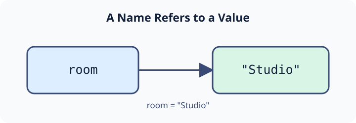

A variable is a name referring to a value. The arrow shows `room` referring to the string `"Studio"`, rather than storing the letters inside the name itself.

The working sign below uses `room = "Studio"`. `=` assigns the value to the name, and `print(room)` displays that value. Names are case-sensitive (`room` differs from `Room`), cannot start with a digit, and usually use `snake_case` for multiple words. Use `#` for a comment that Python ignores.

Edit **only** the assigned room value in `main.py` to `"Gallery"`. Press **Run** to see `Gallery`, then **Submit**. The next exercise uses different names and a different setting.

## Your Task

1. Change `room` to the string `"Gallery"` so the printed sign changes.
