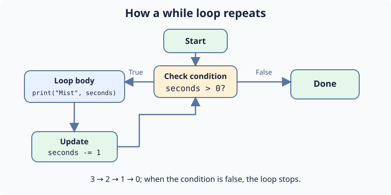

A beacon pulses while its counter is positive. `while` checks before every turn; the indented body decrements `pulses` so it stops. The starter prints `Pulse 3`, `Pulse 2`, `Pulse 1`, then `Beacon steady`.

Change only the starting `pulses` from `3` to `4` in **main.py**. Press **Run** for an extra `Pulse 4`, then **Submit**. Never remove the decrement or the loop may not end.

## Your Tasks

1. Start `pulses` at `4`.
