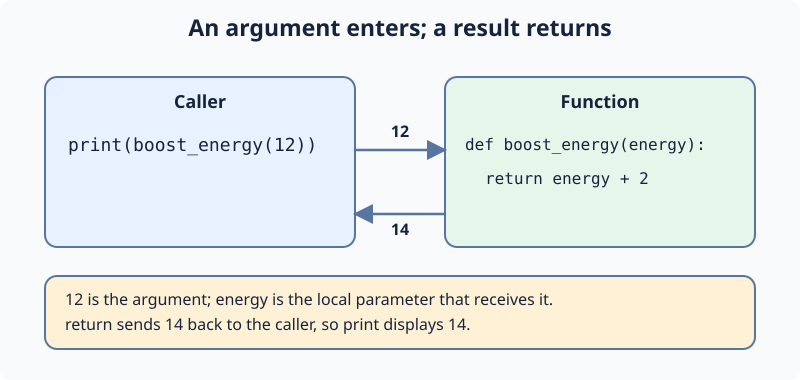

# Pass Energy and Return a Result: Demo

An ability takes an **argument** at its call. The parameter `energy` receives that value locally, and `return` sends the boosted amount back. Ari tries a two-point boost at the workshop.

In `main.py`, change `boost_energy(10)` to `boost_energy(12)`. Run to see `14`, then Submit. The next exercise writes a different calculation.

## Your Tasks

1. Change the argument in the supplied print call to `12`, producing `14`.
