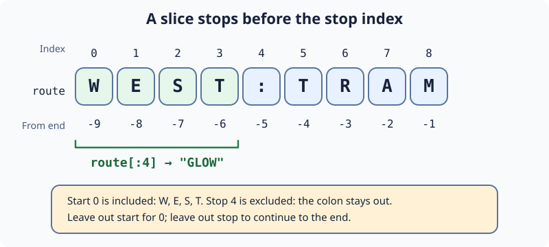

# Slice a Cavern Route: Demo

Ari finds `GLOW:TRAM` carved on a route sign. `text[start:stop]` includes the start but not the stop; omitting the start begins at zero. A slice past the end is safe, unlike an invalid single index.

Change `district` in `main.py` to slice out `GLOW`. Run should print `GLOW`; then Submit. The next task separates another sign's fields.

## Your Task

1. Slice `route` to set `district` to `"GLOW"`.
