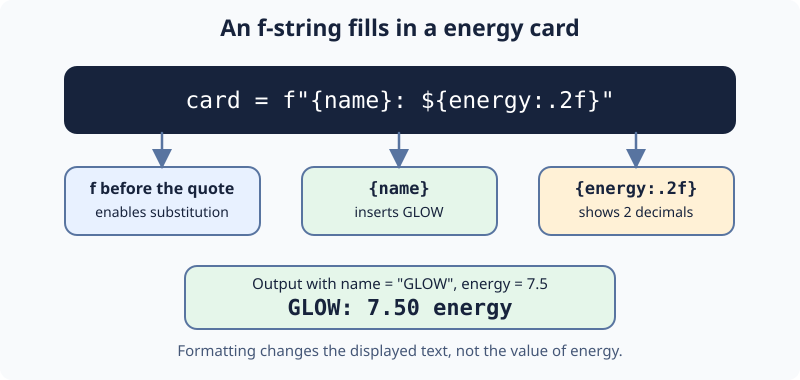

# Format a Route Card: Demo

Ari copies a cavern waypoint onto a card. An `f` before the quote lets `{name}` insert a value; `{energy:.2f}` shows two decimal places without changing the number. This builds on the f-strings from First Steps.

Change the f-string in `main.py` so Run prints `GLOW: 7.50 energy`; then Submit. The next sign uses different values.

## Your Task

1. Set `card` with an f-string displaying `energy` to two decimal places.
