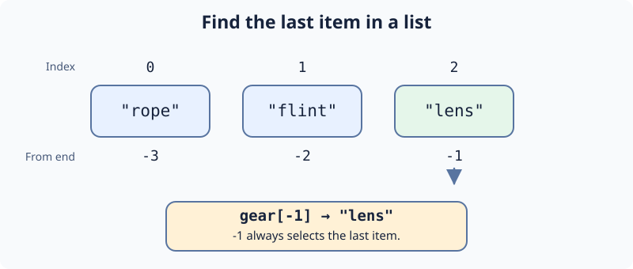

# Index a Gear List: Demo

Ari arrives at Inventory Ridge with a decoded route. A list keeps gear in order: index zero is first, `-1` is last, and `len(gear)` counts items. An index beyond the list raises `IndexError`.

Change `last_gear` in `main.py` to select the last item. Run should print `lens`, then Submit. The next exercise builds a different list.

## Your Task

1. Set `last_gear` to the last item of `gear`.
