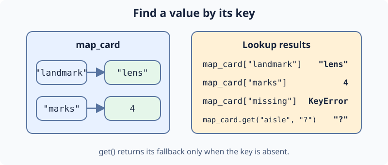

Ari opens the Map Archive. Each map card has a named landmark and a count of marks. Dictionary keys let Ari retrieve a field without guessing its position. `map_card["landmark"]` reads a known key; assigning `map_card["marks"]` changes a value. An absent key raises `KeyError`, while `.get("route", "unknown")` gives a safe fallback.

Edit `main.py`, press **Run**, then **Submit**. The first line should change from `4` to `lens`; the later lines should show `Marks: 9` and `Route: unknown`. The next exercise uses a different map record.

## Your Task

1. Read `map_card["landmark"]` into `landmark`.
